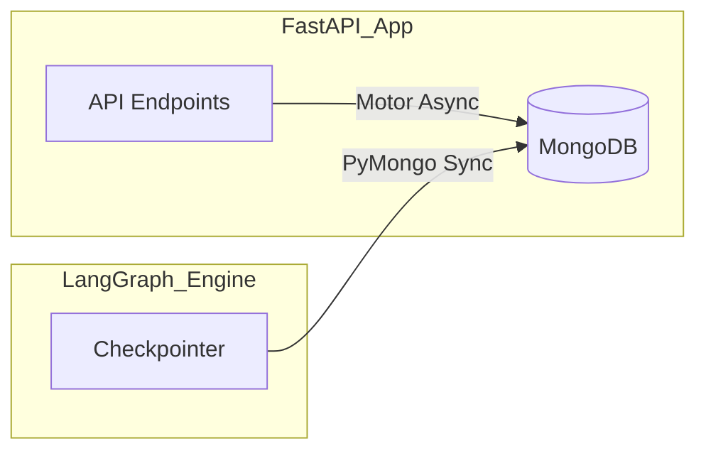

# Resumen Backend - Proyecto SPHERE

**Sistema Multi-Agente con RAG y LangGraph**

---

## 🗓️ Cronología del Trabajo

### **21 diciembre, 2025 - Configuración Inicial Backend**

#### Hitos
- ✅ Estructura inicial de FastAPI creada
- ✅ Configuración de MongoDB Atlas con conexión segura
- ✅ Endpoint `/api/v1/health` implementado
- ✅ Archivo `config.py` con pydantic-settings
- ✅ Base de conexión a MongoDB (`database.py`)

---

### **27 enero, 2026 - Sistema Multi-Agente Completo**

#### Hitos

##### 1. **Vectorización de la Base de Conocimiento**
- ✅ **74 documentos vectorizados** con OpenAI `text-embedding-3-small`
- ✅ Índice vectorial creado en MongoDB Atlas (`vector_index`)
- ✅ Script `etl/scripts/vectorize_corpus.py` funcionando al 100%
- ✅ Búsqueda semántica probada exitosamente

##### 2. **Orquestador Multi-Agente (LangGraph)**
- ✅ `app/core/orchestrator.py` implementado con LangGraph
- ✅ Router inteligente con DeepSeek (deepseek-chat)
- ✅ Clasificación automática: CTO, CEO, CFO, CMO, FINAL
- ✅ Grafo de estados: Router → Expert Agent → END

##### 3. **Sistema RAG (Retrieval Augmented Generation)**
- ✅ `app/core/rag.py` implementado
- ✅ Búsqueda vectorial filtrada por `agent_target`
- ✅ Contexto de 3 documentos más relevantes por consulta
- ✅ Integración OpenAI + MongoDB Vector Search

##### 4. **Endpoint de Chat API**
- ✅ `app/api/v1/chat.py` - POST `/api/v1/chat/`
- ✅ CORS habilitado para frontend
- ✅ Swagger UI disponible en `/docs`
- ✅ Integración completa: FastAPI → LangGraph → RAG → DeepSeek

##### 5. **Dependencias Instaladas**
```
langgraph==1.0.7
langchain-openai==1.1.7
langchain-mongodb==0.11.0
langchain-core==1.2.7
motor==3.7.1
pydantic-settings (actualizado)
```

---

### **30 enero, 2026 - Streaming SSE y Optimización API**

#### Hitos
- ✅ **Implementación de Streaming (SSE)**: Migración de respuesta estática a Server-Sent Events para una experiencia de chat en tiempo real.
- ✅ **Refactor de Orquestación**: Ajustes en el `orchestrator.py` para soportar la emisión de tokens por roles.
- ✅ **Nuevo Endpoint `/api/v1/chat/stream`**: Endpoint especializado para streaming con manejo de errores robusto.
- ✅ **Mejora en Prompting**: Ajustes en el Router para asegurar que los agentes generen bloques de código y tablas detectables por el frontend.

---

## 📊 Estado Actual del Sistema

### Arquitectura
```
┌─────────────┐     ┌──────────────┐     ┌─────────────┐
│   FastAPI   │────▶│  LangGraph   │────▶│  DeepSeek   │
│   /chat     │     │ Orchestrator │     │   (LLM)     │
└─────────────┘     └──────────────┘     └─────────────┘
                           │
                           ▼
                    ┌──────────────┐     ┌─────────────┐
                    │     RAG      │────▶│  MongoDB    │
                    │  retrieve()  │     │  Vector DB  │
                    └──────────────┘     └─────────────┘
```

### Endpoints Disponibles
| Método | Endpoint | Descripción |
|--------|----------|-------------|
| GET | `/docs` | Swagger UI |
| GET | `/api/v1/health/` | Health check |
| POST | `/api/v1/chat/` | Chat con SPHERE |

### Ejemplo de Uso
```bash
curl -X POST http://localhost:8000/api/v1/chat/ \
  -H "Content-Type: application/json" \
  -d '{"query": "Cómo escalamos la base de datos?"}'
```

**Respuesta:**
```json
{
  "role": "CTO",
  "response": "Desde mi perspectiva técnica..."
}
```

---

### **31 enero, 2026 - Infraestructura de Persistencia y Testing (Refactorización)**

#### Hitos
- ✅ **Arquitectura Dual de MongoDB**: Implementación de clientes separados:
    - `AsyncIOMotorClient` para FastAPI y endpoints API.
    - `MongoClient` (Síncrono) para el Checkpointer de LangGraph.
    - **Solución**: Erradicación de bloqueos de hilos y desincronización de datos.
- ✅ **Structured Logging system**: Creación de `app/core/logger.py` con logs coloreados, ISO timestamps y contexto de ejecución.
- ✅ **Suite de Testing (29 tests)**: Implementación de tests exhaustivos en `backend/tests/`:
    - `test_connection.py`: Estabilidad de la conexión dual.
    - `test_sessions.py` & `test_agents.py`: CRUD de datos.
    - `test_checkpoint.py`: Persistencia de memoria de LangGraph.
- ✅ **Script de Ejecución Local**: Creación de `run_local.py` para desarrollo fuera de Docker con logs técnicos legibles.
- ✅ **Correciones Críticas**:
    - Reparado error "Event loop is closed" mediante sincronización de scopes en `pytest`.
    - Reparado error `KeyError: 'checkpoint_ns'` en el checkpointer de MongoDB.

---

## 📊 Estado Actual del Sistema

### Arquitectura de Conexión


### Endpoints Disponibles
| Método | Endpoint | Descripción |
|--------|----------|-------------|
| GET | `/api/v1/health/health` | Health check + Latencia DB |
| POST | `/api/v1/sessions/` | Crear sesión de chat |
| GET | `/api/v1/sessions/` | Listar sesiones históricas |
| POST | `/api/v1/stream/` | Chat Streaming (SSE) con Memoria |

---

## 🎯 Logros Clave

### ✅ Técnicos
1. **Memoria Inquebrantable**: El historial de chat persiste correctamente entre reinicios y múltiples sesiones.
2. **Estabilidad Verificada**: Suite de 29 tests en verde asegura que no habrá regresiones.
3. **Visibilidad Total**: Logs enriquecidos permiten debuguear fallos en segundos.

---

## 🔮 Próximos Pasos

### Inmediato
1. **RAG para Expertos Custom**: Ingesta de documentos específicos para agentes creados por el usuario.
2. **Optimización de Streaming**: Reducción de latencia en la detección de etiquetas `<sphere_artifact>`.

---

**Última actualización**: 31 de enero, 2026 (Noche)  
**Estado del proyecto**: ✅ Backend Robusto, Testeado y listo para Escalado de RAG Custom
